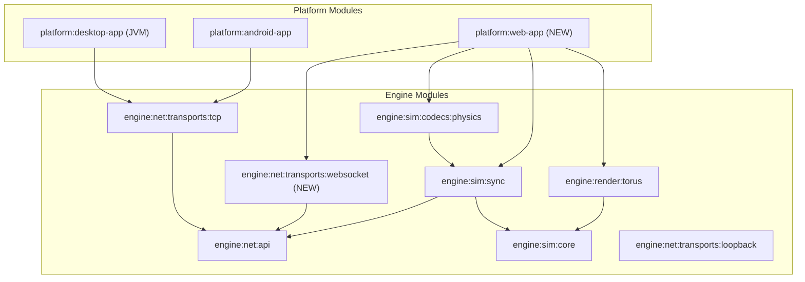

<!-- c9ca527d-b97a-4e2d-bcb0-f3d5f75727e6 -->
---
todos:
  - id: "phase1-js-targets"
    content: "Phase 1: Re-add js(IR) { browser() } to engine module build files (sim-core, sim-sync, sim-codecs, net-api, net-loopback)"
    status: pending
  - id: "phase2-float-buffer"
    content: "Phase 2: Abstract FloatBuffer -- introduce expect/actual GpuFloatBuffer, update GPU.kt / ScreenLayout / CircleShader / platform actuals"
    status: pending
  - id: "phase3-webgl2-gpu"
    content: "Phase 3: Implement GPU.js.kt with WebGL2 bindings and int-to-object ID bridging"
    status: pending
  - id: "phase4-web-app"
    content: "Phase 4: Create platform/web-app module (build.gradle.kts, index.html, WebMain.kt, WebInputHandler.kt, requestAnimationFrame loop)"
    status: pending
  - id: "phase5-websocket"
    content: "Phase 5: WebSocket transport module (JS client Pipe over browser WebSocket, JVM server accept loop for host)"
    status: pending
isProject: false
---
# Web Platform Reintroduction

## Current State

The engine modules previously had `js(IR) { browser() }` targets (removed around commit `1ab7f19`). Two jsMain actual files still exist on disk and are tracked at HEAD:

- `engine/net/api/src/jsMain/.../AtomicRef.kt` -- trivial single-threaded impl
- `engine/sim/sync/src/jsMain/.../Sleep.js.kt` -- no-op (JS can't block)

Three `expect` declarations need `actual` JS implementations:

- `AtomicRef<T>` in `engine/net/api` -- already done
- `sleepMillis()` in `engine/sim/sync` -- already done
- `GPU` object in `engine/render/torus` -- **needs writing** (WebGL2, ~40 functions)

## Blockers in commonMain

`java.nio.FloatBuffer` and `java.nio.ByteBuffer` are used directly in three commonMain files inside `engine/render/torus`:

- `GPU.kt` -- `bufferData(..., data: FloatBuffer, ...)`
- `ScreenLayout.kt` -- allocates a `FloatBuffer` for vertex data
- `shader/CircleShader.kt` -- allocates 6 `FloatBuffer`s for instanced draw data

These JVM types don't exist in Kotlin/JS. They need to be replaced with a platform-agnostic abstraction.

## Architecture



The web client will be a **thin client** (receives state snapshots from host, no local simulation). This sidesteps the simulation performance concern that motivated thin mode in the first place, and avoids needing to ship the full physics sim to the browser.

## Phase 1: Get engine modules compiling to JS

Re-add `js(IR) { browser() }` to all engine module `build.gradle.kts` files that use the `kotlin-mpp` convention plugin:

- `engine/sim/core/build.gradle.kts`
- `engine/sim/sync/build.gradle.kts`
- `engine/sim/codecs/physics/build.gradle.kts`
- `engine/net/api/build.gradle.kts`
- `engine/net/transports/loopback/build.gradle.kts`

NOT added to:
- `engine/net/transports/tcp` -- raw TCP sockets are JVM-only; browsers use WebSockets
- `engine/render/torus` -- blocked on Phase 2 (FloatBuffer abstraction + WebGL2)
- `demos/physics` -- has jvmAndAndroidMain sources with Thread/TCP; web wiring goes in platform/web-app instead

Verify with `gradlew compileKotlinJs` across these modules.

## Phase 2: Abstract FloatBuffer out of commonMain

The `GPU.bufferData` signature and the `FloatBuffer` usage in `ScreenLayout` and `CircleShader` need to become platform-agnostic.

**Approach**: Introduce an `expect class GpuFloatBuffer` in `engine/render/torus/src/commonMain/`:

```kotlin
// commonMain
expect class GpuFloatBuffer(capacity: Int) {
    fun clear()
    fun put(src: FloatArray, offset: Int, length: Int): GpuFloatBuffer
    fun flip()
}
```

- **jvmMain/androidMain actual**: wraps `java.nio.FloatBuffer` via `ByteBuffer.allocateDirect(...).order(nativeOrder()).asFloatBuffer()`
- **jsMain actual**: wraps `org.khronos.webgl.Float32Array`

Change `GPU.bufferData` signature from `FloatBuffer` to `GpuFloatBuffer`. Update `ScreenLayout` and `CircleShader` to use `GpuFloatBuffer` instead of raw NIO types.

Update the `GPU.jvm.kt` and `GPU.android.kt` actuals to unwrap the buffer.

Then add `js(IR) { browser() }` to `engine/render/torus/build.gradle.kts`.

## Phase 3: Implement GPU.js.kt (WebGL2)

Create `engine/render/torus/src/jsMain/kotlin/org/emerge/render/torus/GPU.js.kt`.

Kotlin/JS provides WebGL2 bindings via `org.khronos.webgl.*` (WebGL2RenderingContext). The JS GPU actual needs:

- A late-initialized `WebGL2RenderingContext` reference (set at startup from the canvas)
- `shaderVersion = "300 es"` (same as Android/GLES3)
- All ~40 functions mapped to WebGL2 calls
- Handle ID management: WebGL uses object references (`WebGLBuffer`, `WebGLTexture`, etc.) not ints. Need an `IntObjectMap` to bridge the int-based `expect` API to WebGL object references.

The GLSL shaders already support `#version 300 es` (the Android path uses it). Shader source strings in `CircleShaderSources`, `WorldShaderSources`, `GuiShaderSources` should work as-is with the `300 es` version string since the existing Android shaders already target ES 3.0.

## Phase 4: Create platform/web-app module

New Gradle module: `platform/web-app`

```
platform/web-app/
  build.gradle.kts          -- Kotlin/JS browser application
  src/jsMain/
    kotlin/
      org/emerge/web/
        WebMain.kt           -- entry point, canvas setup, requestAnimationFrame loop
        WebInputHandler.kt   -- keyboard event listeners -> PhysicsInput
    resources/
      index.html             -- minimal HTML with a <canvas> element
```

- `build.gradle.kts`: `kotlin { js(IR) { browser { ... } } }`, depends on `:engine:render:torus`, `:engine:sim:sync`, `:engine:sim:codecs:physics`, `:engine:net:transports:websocket`
- `WebMain.kt`: gets canvas, creates `WebGL2RenderingContext`, initializes `GPU`, creates `ScreenRenderer`, runs `requestAnimationFrame` loop calling `renderer.draw(state, myId)` each frame
- Thin client only: receives state snapshots, no local sim
- Add to `settings.gradle.kts`: `include(":platform:web-app")`

## Phase 5: WebSocket transport

New module: `engine/net/transports/websocket`

Two parts:

**JS client side** (`jsMain`):
- `WebSocketPipe` implementing `Pipe` interface over browser `WebSocket` API
- Connects to `ws://host:port`, sends/receives binary frames
- Maps to existing `Pipe.send(ByteArray)` / `Pipe.receive(): ByteArray?` / `Pipe.isOpen(): Boolean`

**JVM host side** (`jvmMain`):
- Lightweight WebSocket server accept loop (or use a small library like `Java-WebSocket`)
- Produces `Pipe` instances that the host feeds to `LockstepHost.acceptClient(pipe, ClientMode.THIN)`

The host controller (`PhysicsHostController` / `PhysicsHeadlessHostController`) would then accept connections from both TCP and WebSocket listeners, funneling both into the same `readyClients` queue.

Alternative: instead of a new transport module, run a standalone WebSocket-to-TCP bridge process. Simpler but adds deployment friction.

## Execution Order

Phases 1 and 2 can be done together (they are the foundation). Phase 3 depends on Phase 2. Phase 4 depends on Phase 3. Phase 5 can be developed in parallel with Phase 3/4 (the Pipe interface is already defined) but is needed for Phase 4 to actually connect to a host.

Phase 1+2 is a good stopping point to verify the whole engine compiles to JS before writing the WebGL2 and web-app code.
