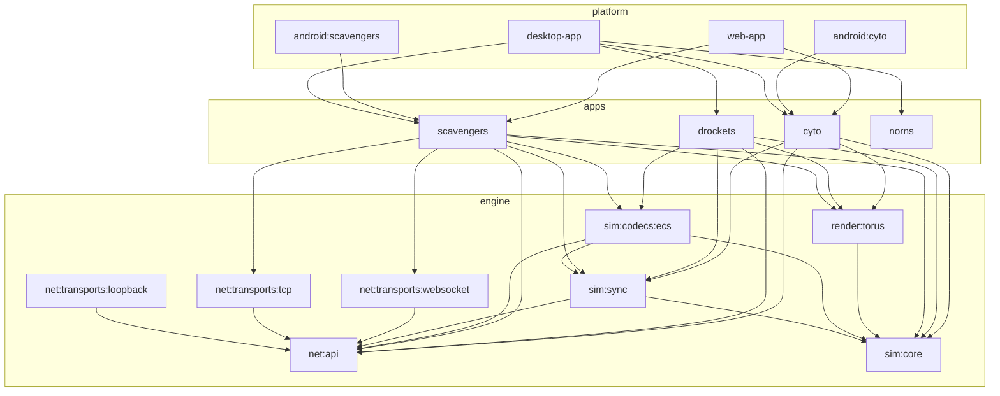

# Emerge

This repo is a Kotlin Multiplatform foundation for a game engine (deterministic simulation +
networking + torus rendering) with apps that exercise the engine on desktop, Android, and web.

### Repo layout (how to navigate)

- **`engine/`**: reusable, game-agnostic engine modules (simulation, networking, rendering)
- **`apps/`**: the games/sims built on the engine (`scavengers`, `drockets`, `cyto`, `norns`)
- **`platform/`**: platform hosts (desktop + web multi-app launchers; per-app Android shells
  under `platform/android/`)
- **`buildSrc/`**: Gradle convention plugins
- **`gradle/`**: version catalog + wrapper

The engine is **game-agnostic**: it knows nothing about rockets, planets, crashes, respawns, or
cells. Each app brings its own config, input type, state extensions, and codec registry. (See
`emerge-modularization-plan.md` for the history of how Scavengers-flavored types were extracted
out of the engine.)

### Gradle modules (what depends on what)

#### Core layering

- **Networking**
  - `:engine:net:api` (base `Pipe` + byte codecs)
  - `:engine:net:transports:loopback` → `:engine:net:api`
  - `:engine:net:transports:tcp` → `:engine:net:api`
  - `:engine:net:transports:websocket` → `:engine:net:api`

- **Simulation**
  - `:engine:sim:core` — deterministic fixed-point tick, ECS infrastructure (immutable-snapshot
    `EcsWorld`/`ComponentStore` **and** the struct-of-arrays `SoaWorld`/`ColumnStore` framework
    under `ecs/soa/`), wrapping torus, generic physics primitives + systems (integration,
    contacts, gravity, springs, particles, …), `SimState`/`SimInput`/`PhysicsTuning`.
  - `:engine:sim:sync` → `:engine:sim:core`, `:engine:net:api` (lockstep/state sync)
  - `:engine:sim:codecs:ecs` → `:engine:sim:core`, `:engine:sim:sync`, `:engine:net:api`
    (generic per-component wire codecs + a per-app `CodecRegistry`; no game-specific shape)

- **Rendering**
  - `:engine:render:torus` → `:engine:sim:core` (wrapping-world shader renderer)

#### Apps (each self-contained: own config, input, state extensions, codecs)

- `:apps:scavengers:core` → `sim:core`, `sim:sync`, `codecs:ecs`, `render:torus`, `net:api`,
  `net:transports:tcp`, `net:transports:websocket` — the full-featured networked reference game.
- `:apps:drockets:core` → `sim:core`, `sim:sync`, `codecs:ecs`, `render:torus`, `net:api` —
  rocketry + genetics demo. Carries a shadow struct-of-arrays reducer under `soa/`
  (`DrocketsWorld`/`DrocketsSoaReducer`), gated against the canonical reducer by
  bit-identity equivalence tests.
- `:apps:cyto:core` → `sim:core`, `sim:sync`, `render:torus`, `net:api` — native ECS cell sim on
  the wrapping fixed-point torus (Cyto port). Also carries a shadow SoA reducer under `sim/soa/`.

#### Platform hosts

- `:platform:desktop-app` → all apps (+ engine + loopback/tcp/websocket, LWJGL).
  Run tasks: `run`, `runDrockets`, `runCyto`, plus Drockets benchmark harnesses.
- `:platform:android:scavengers` → `:apps:scavengers:core` (standalone Android app).
- `:platform:android:cyto` → `:apps:cyto:core` (standalone Android app).
- `:platform:web-app` → `:apps:scavengers:core`, `:apps:cyto:core` (Kotlin/JS, websocket transport;
  app selected via `?demo=cyto`).

#### Visual map

### Build & run

Use the Gradle Wrapper:

- **Build everything**: `./gradlew build`
- **Run tests**: `./gradlew test`
- **Desktop (default demo)**: `./gradlew :platform:desktop-app:run`
- **Desktop — Drockets**: `./gradlew :platform:desktop-app:runDrockets`
- **Desktop — Cyto**: `./gradlew :platform:desktop-app:runCyto`
- **Android debug**: `./gradlew :platform:android:cyto:installDebug` (or `:platform:android:scavengers:installDebug`)
- **Web**: build/serve `:platform:web-app` and open with `?demo=cyto` (or the default app)

### Kotlin Multiplatform notes (source set hierarchy)

This repo **adopts the default Kotlin MPP hierarchy template** (so Android/JVM source sets follow
Kotlin’s standard layout).

Some modules intentionally add a single shared source set called **`jvmAndAndroidMain`** (with
sources in `src/jvmAndAndroidMain/kotlin`) for “JVM-only glue” that should compile on both desktop
JVM and Android.

### Struct-of-arrays (SoA) engine track

`:engine:sim:core` ships an SoA framework (`ecs/soa/`: `ColumnStore`, `ComponentColumns`,
`SoaWorld`, `ColumnPartition`, `SpringCsr`, plus a `SoaCompat` gather/scatter shim for cold
systems) that runs *alongside* the canonical immutable-snapshot ECS. It mutates columns in place
— no per-tick rebuild — for a large performance win on hot systems. `SoaWorld` reproduces the
`EcsWorld` entity-id allocator byte-for-byte so a ported reducer stays bit-identical to its
array-of-structs original; that equivalence is enforced by per-demo gate tests. The Drockets and
Cyto SoA reducers currently exist as **validated shadow paths** (test-gated, not yet the live
runtime).

### Windows notes (AV / file locking)

On some Windows setups, real-time AV/indexers can hold Gradle/AGP intermediates open (common
symptom: failing to delete something like `R.jar`).

This repo uses **stable** `.build/<module>` directories (no per-run timestamped build dirs).
If you hit file locks, the intended fix is to **exclude the repo’s `.build/` directory from
real-time scanning**.

### Roadmap

- [ ] Land the SoA reducer as the live runtime path (currently a test-gated shadow for
      Drockets + Cyto) and generalize the per-demo `World`/`Columns`/`Reducer` boilerplate.
- [ ] Set up a remote server to host the backend and web frontend
- [x] Merge Drockets repo into Emerge
- [x] Merge Cyto repo into Emerge — `:apps:cyto:core` runs natively on the engine
      (`./gradlew :platform:desktop-app:runCyto`). The cell sim is a deterministic ECS
      reducer on the engine's fixed-point torus, using a generic `SpringConstraintSystem`
      (in `:engine:sim:core`) in place of Box2D distance joints. The world wraps
      (1024×1024 base cells). Runs on all three hosts — desktop (`runCyto`), Android
      (`CytoActivity`), and web (`?demo=cyto`) — with cell-drag and on-screen controls.

#### Experiments

- [ ] Integer sine and cosine functions for converting angle+magnitude to a vector
- [ ] Networking connection that transfers only transform positions per force-affected entity.
      Client-side can infer velocity and possibly forces to apply when packets are sparse.
