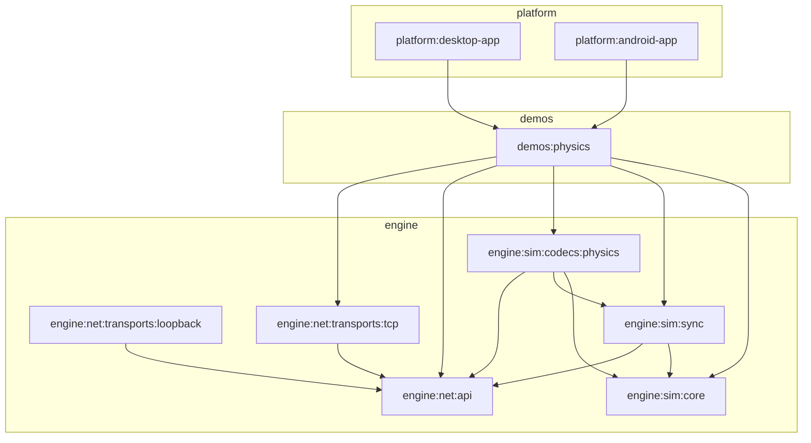

# Emerge

This repo is a Kotlin Multiplatform foundation for a game engine (simulation + networking) with demo hosts for desktop + Android.

### Repo layout (how to navigate)

- **`engine/`**: reusable engine modules (simulation + networking)
- **`demos/`**: sample implementations that exercise engine modules (currently: physics)
- **`platform/`**: platform hosts / apps (desktop + Android)
- **`buildSrc/`**: Gradle convention plugins
- **`gradle/`**: version catalog + wrapper

### Gradle modules (what depends on what)

#### Core layering

- **Transports**
  - `:engine:net:api` (base `Pipe` + byte codecs)
  - `:engine:net:transports:loopback` → `:engine:net:api`
  - `:engine:net:transports:tcp` → `:engine:net:api`

- **Simulation**
  - `:engine:sim:core` (deterministic tick + torus + toy physics)
  - `:engine:sim:sync` → `:engine:sim:core`, `:engine:net:api`
  - `:engine:sim:codecs:physics` → `:engine:sim:core`, `:engine:sim:sync`, `:engine:net:api`

- **Demos**
  - `:demos:physics` → `:engine:sim:*`, `:engine:net:api`, `:engine:net:transports:tcp`

- **Platform hosts**
  - `:platform:desktop-app` → `:demos:physics` (+ LWJGL)
  - `:platform:android-app` → `:demos:physics`

#### Visual map

### Build & run

Use the Gradle Wrapper:

- **Build everything**: `./gradlew build`
- **Desktop**: `./gradlew :platform:desktop-app:run`
- **Android debug**: `./gradlew :platform:android-app:installDebug`

### Kotlin Multiplatform notes (source set hierarchy)

This repo **adopts the default Kotlin MPP hierarchy template** (so Android/JVM/JS source sets follow Kotlin’s standard layout).

Some modules intentionally add a single shared source set called **`jvmAndAndroidMain`** (with sources in
`src/jvmAndAndroidMain/kotlin`) for “JVM-only glue” that should compile on both desktop JVM and Android.

### Windows notes (AV / file locking)

On some Windows setups, real-time AV/indexers can hold Gradle/AGP intermediates open (common symptom: failing to delete something like `R.jar`).

This repo uses a **stable** `.build/<module>` directory by default for good caching.
If you still hit file locks you have two options:

- **Recommended**: exclude the repo’s `.build/` directory from real-time scanning.
- **Fallback**: run Gradle with `-Pemerge.uniqueBuildDir=true` to use a fresh `.build/<module>-<timestamp>` per invocation (avoids deletes, but uses more disk and reduces caching).

### Roadmap

#### Nice-to-have (engine direction)

- [ ] Consider extracting reusable rendering utilities from `:demos:physics` into `engine/render/*` if they’re meant to be engine features
- [ ] Add a `:platform:web-app` host to match the existing JS targets (even a minimal harness)